# Containerisation et mise en production back + front projet final
### Pablo Huys

## <u>1. Test en local</u>

Dans un premier temps, afin de tester la communication entre le front et le back-end,
j'ai du ouvrir 2 terminaux sur chacune des parties. Pour initialiser les projets node,
j'ai utilisé la commande:
```
npm init
```

Côté back, j'ai aussi du initialiser la **BDD** avec les commandes:
```
npx prisma generate dev
npx prisma migrate dev
```
Une fois ces deux choses de fait, je pouvais accéder au front et me connecter avec un
compte de test en lançant les deux projets avec ``npm run start et npm run dev``

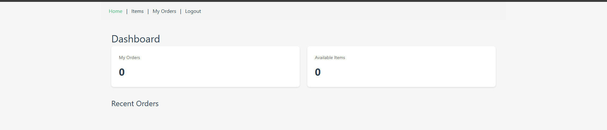

## <u>2. Création des containers</u>

Pour la création des containers, j'ai ajouté un **Dockerfile** dans le front et dans le back,
ces fichiers se chargent de copier le front et le back dans des containers, d'initialiser la BDD
et d'exposer les ports puis finalement lancer les applications.

Le docker compose lui se charge de créer les services à partir des docker files et de les rassembler dans le 
même network.

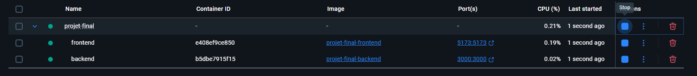

Pour ce qui est des images, le front-end est assez light mais le back-end est lourd même
sous version alpine. Je n'ai pas trouvé comment optimiser d'avantages.

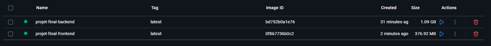

## <u>3. Déploiement avec **Railway**</u>

J'ai décidé d'opter pour Railway afin de déployer mon application éfficacement sur une plateforme que j'ai déjà utilisé en entreprise.

Avant de commencer la partie déploiment il faut savoir que railway fonctionne différement de scaleway:
 - Railway ne gère pas le docker-compose, il faut donc créer 2 repositories, un pour le front et un pour le back.
 - Par défaut, Railway va se lier à un repository et lancer soit le contexte nodeJS ou alors le Conteneur quelqu'il soit. Railway se chargera de rebuild le Dockerfile automatiquement, ce que je vais désactiver pour pouvoir faire les github actions  et avoir plus de contrôle sur le déploiement.

**Afin d'éviter des frais couteux, je me chargerais de mettre en production le back-end mais d'utiliser une instance local du front-end pour les requêtes**

(Url du repository du back-end: https://github.com/IF0rst/projet-final-back)

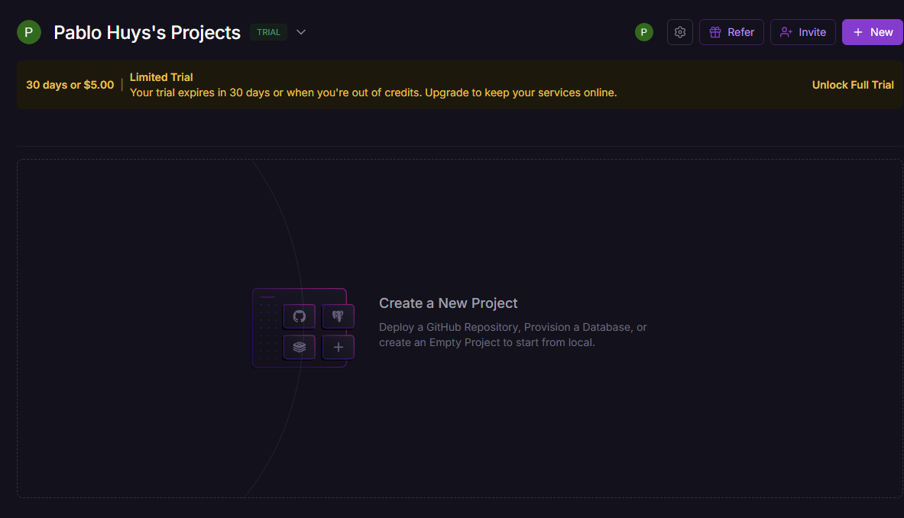

Dans un premier temps, il faut créer un nouveau projet.

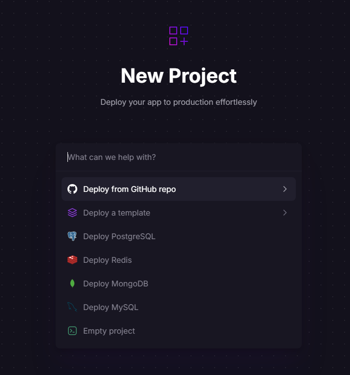

Nous avons la possibilité de choisir un repository github

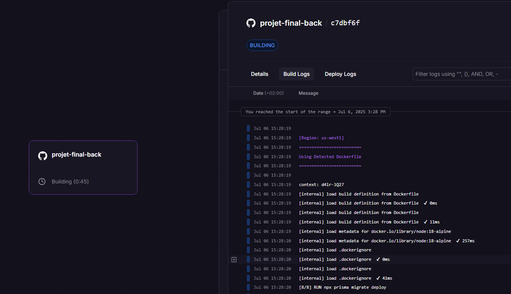

Une fois le repository choisi, Railway va se charger de détecter le type de projet à deployer.
Railway a bien selectionné docker et se charge de faire le build initial.

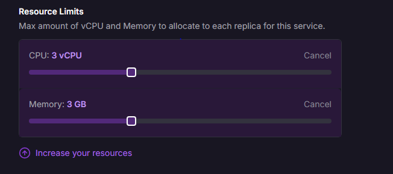

Je vais ensuite m'assurer de limiter les ressources du projet pour éviter des frais supplémentaires.

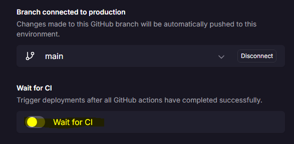

Je vais aussi activer l'option CLI pour empêcher le rebuild automatique et ajouter mes propres vérifications.

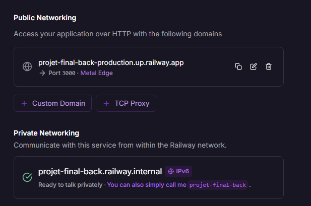

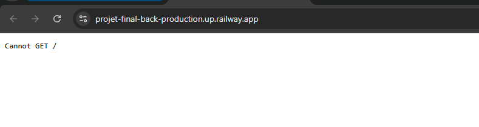
Enfin, je vais ajouter un domaine auto-généré pour pouvoir accéder à l'API sur internet

## <u>4. Mise en place des github actions</u>

### 1) Vérification des vulnérabilités

Pour commencer , je vais me diriger sur la partie **actions** de mon repository projet-final-back pour y ajouter une action.

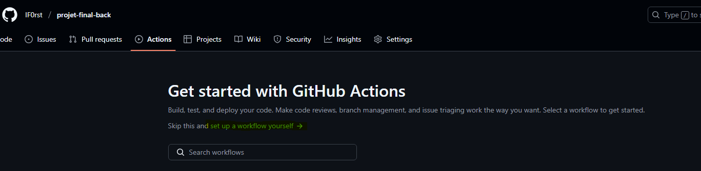

Ensuite, je vais ajouter des vérifications sur la branche **main** lors de push ou pull request.
j'ai choisi d'utiliser un contexte ubuntu simple.

Pour les steps, je vais commencer par installer nodeJS et d'installer les dépendences.
je vais aussi utiliser **npm-audit** (https://docs.npmjs.com/cli/v7/commands/npm-audit) pour scanner
le code. Si npm-aduit detecte une vulnérabilité de type "high" alors une erreur sera renvoyée et Railway ne relancera pas le Dockerfile

